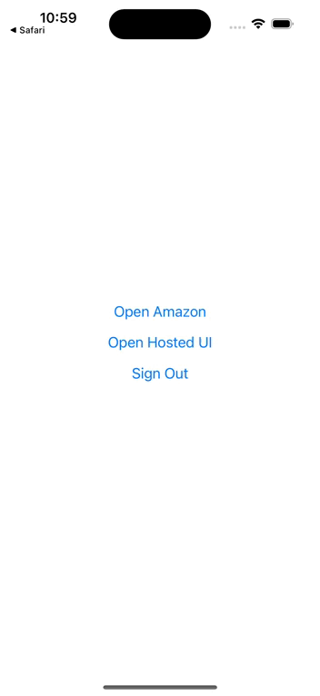

# CognitoAmplify

> CognitoAmplify is a project used to demonstrate the use of AWS Cognito and Amplify in a React Native application. For this application I have utilized the AWS Amplify platform and Cognito to create a user authentication system. This application is a simple React Native application that allows users to sign up, & sign in with help of Social Login as Google and the traditional flow of email & password.

## Key Features of the Application

- AWS Amplify
- AWS Cognito
- Social Login via Google Authentication

## Tools & Technologies Used

- [![AWSS3][AWSS3]][AWSS3-url]
- [![AWS Amplify][AWSAmplify]][AWSAmplify-url]
- [![Google Cloud][GoogleCloud]][GoogleCloud-url]
- [![React Native][ReactNative]][ReactNative-url]

[ReactNative]: https://img.shields.io/badge/react_native-%2320232a.svg?style=for-the-badge&logo=react&logoColor=%2361DAFB
[ReactNative-url]: https://reactnative.dev/
[AWSAmplify]: https://img.shields.io/static/v1?style=for-the-badge&message=AWS+Amplify&color=222222&logo=AWS+Amplify&logoColor=FF9900&label=
[AWSAmplify-url]: https://aws.amazon.com/amplify/
[AWSS3]: https://img.shields.io/badge/AWS-%23FF9900.svg?style=for-the-badge&logo=amazon-aws&logoColor=white
[AWSS3-url]: https://aws.amazon.com/
[GoogleCloud]: https://img.shields.io/static/v1?style=for-the-badge&message=Google+Cloud&color=4285F4&logo=Google+Cloud&logoColor=FFFFFF&label=
[GoogleCloud-url]: https://cloud.google.com/

## Installation

### Prerequisites

- [Node.js](https://nodejs.org/en/)
- [Java](https://www.java.com/en/)
- [Android Studio](https://developer.android.com/studio)
- [Xcode](https://developer.apple.com/xcode/)
- [AWS Account](https://aws.amazon.com/)
- [Google Cloud Account](https://cloud.google.com/)

### Clone

> Clone this repo to your local machine

```shell
$ git clone https://github.com/Jeet989/AWSAmplify-Cognito.git
```

### Setup

> Install npm packages

```shell
npm install
```

> Install pod dependencies

```shell
$ cd ios && pod install && cd ..
```

> Fetch latest backend environment

```shell
$ amplify pull
```

> Run the mobile application

```shell
$ npx react-native run-android
```

## Application Preview


<br />
